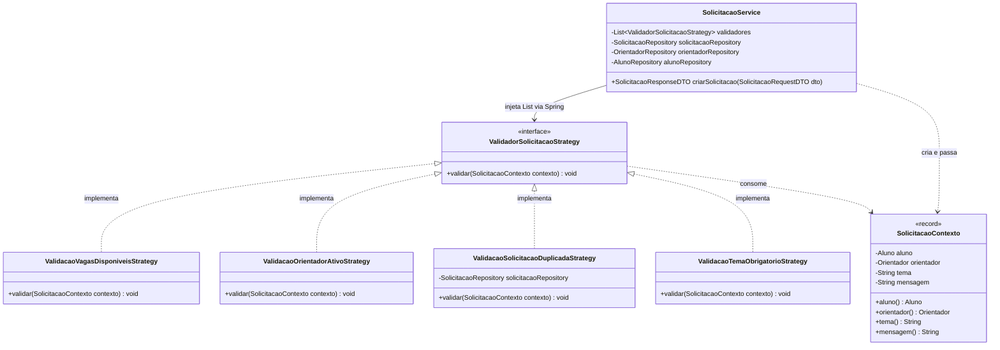
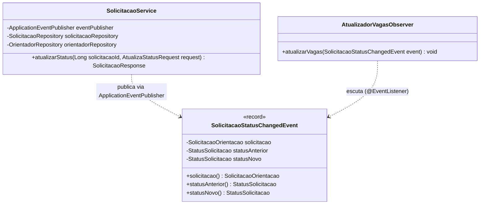
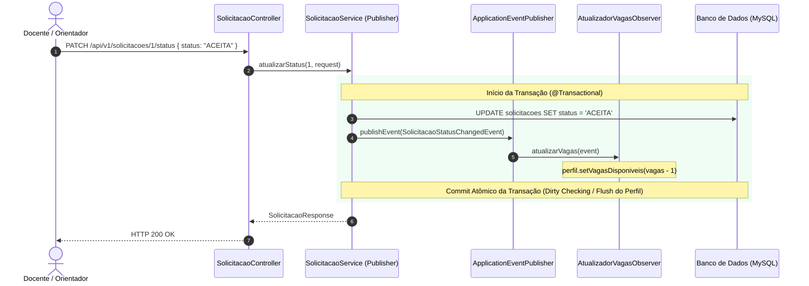

# Documento de Arquitetura: Aplicação de Padrões de Projeto OO na US04

> **SIGTCC - Sistema de Gestão Centralizada de TCC**  
> **Artefato:** `docs/PADROES-DE-PROJETO.md`  
> **Autora:** Damares Gaia (Scrum Master & Arquiteta de Software)  
> **Status:** Aprovado  
> **Rastreabilidade:** Issue #11 (US04), Issue #91 (Doc-1 / ADRs), Issue #92 (Doc-2), Issue #83 (Backend Strategy), Issue #84 (Backend Observer)

---

## 1. Introdução e Motivação Arquitetural

No ciclo de desenvolvimento da **Sprint 2 (marco da US04 - Solicitação e Aceite de Orientação)**, a equipe de engenharia identificou desafios arquiteturais críticos na modelagem da camada de negócio do backend:

1. **Validações de Elegibilidade Variáveis e Expansíveis:** A criação de uma solicitação de orientação exige múltiplas checagens de negócio (capacidade de vagas do orientador, orientador ativo, ausência de solicitação pendente duplicada para o mesmo discente, consistência de tema e curso). Concentrar essas checagens em cadeias imperativas de `if/else` dentro de um único serviço viola o princípio **Aberto/Fechado (OCP - _Open/Closed Principle_)**, gerando uma classe inflada (_God Class_) de manutenção arriscada.
2. **Desacoplamento de Reações na Mudança de Estado:** Quando uma solicitação transita para o status `ACEITA`, efeitos colaterais imediatos precisam ser disparados (especificamente o decremento atômico de vaga ofertada pelo orientador). Acoplar essa manipulação diretamente no método de transição do serviço viola o princípio da **Responsabilidade Única (SRP - _Single Responsibility Principle_)**.

Para resolver esses desafios com rigor técnico, foram formalizadas as decisões na [**`ADR-0007`**](file:///c:/Users/damares.gaia/ifsc/es2-2026_2-equipe-3/docs/adrs/ADR-0007.md), adotando dois padrões de projeto clássicos do _Gang of Four (GoF)_: **Strategy** e **Observer**.

Este documento especifica a estrutura de classes, os contratos de interfaces, os diagramas de interação e as diretrizes de implementação para os desenvolvedores backend.

---

## 2. Padrão Strategy (Validações de Elegibilidade da US04)

### 2.1 Problema Resolvido

No fluxo `POST /api/v1/solicitacoes`, cada regra de elegibilidade possui critérios de checagem e exceções semânticas distintas:

- Orientador sem vagas -> erro HTTP 422 (`VagasIndisponiveisException`);
- Orientador inativo -> erro HTTP 422 (`OrientadorInativoException`);
- Solicitação pendente já existente para o mesmo discente e orientador -> erro HTTP 409 (`SolicitacaoDuplicadaException`);
- Tema ou dados obrigatórios ausentes -> erro HTTP 400 (`MethodArgumentNotValidException` ou `RegraDeNegocioException`).

O padrão **Strategy** encapsula cada regra de validação em uma classe especialista independente, permitindo adicionar, alterar ou remover regras futuras sem modificar uma única linha do `SolicitacaoService`.

### 2.2 Diagrama de Classes (Strategy)



### 2.3 Estrutura de Pacotes e Nomenclatura

Os componentes devem ser criados no pacote dedicado:

```
br.edu.ifsc.gestao_tcc.strategy/
├── ValidadorSolicitacaoStrategy.java        (Interface base)
├── SolicitacaoContexto.java                 (DTO/Record de contexto de validação)
├── ValidacaoVagasDisponiveisStrategy.java   (Regra de cota de vagas > 0)
├── ValidacaoOrientadorAtivoStrategy.java    (Regra de orientador ativo no sistema)
├── ValidacaoSolicitacaoDuplicadaStrategy.java (Regra de duplicidade aluno-orientador)
└── ValidacaoTemaObrigatorioStrategy.java    (Regra de consistência do tema)
```

### 2.4 Contratos de Interface e Implementação

#### Interface Central (`ValidadorSolicitacaoStrategy.java`)

```java
package br.edu.ifsc.gestao_tcc.strategy;

public interface ValidadorSolicitacaoStrategy {
    /**
     * Executa a regra de validação específica sobre o contexto da solicitação.
     * @param contexto dados consolidados de Aluno, Orientador e Proposta.
     * @throws RegraDeNegocioException se a regra for violada (HTTP 422).
     * @throws ConflitoDeEstadoException se houver conflito de duplicidade (HTTP 409).
     */
    void validar(SolicitacaoContexto contexto);
}
```

#### Record de Contexto (`SolicitacaoContexto.java`)

```java
package br.edu.ifsc.gestao_tcc.strategy;

import br.edu.ifsc.gestao_tcc.model.Aluno;
import br.edu.ifsc.gestao_tcc.model.Orientador;

public record SolicitacaoContexto(
    Aluno aluno,
    Orientador orientador,
    String tema,
    String mensagem
) {}
```

#### Estratégia de Vagas Disponíveis (`ValidacaoVagasDisponiveisStrategy.java`)

```java
package br.edu.ifsc.gestao_tcc.strategy;

import br.edu.ifsc.gestao_tcc.exception.VagasIndisponiveisException;
import org.springframework.core.annotation.Order;
import org.springframework.stereotype.Component;

@Component
@Order(1)
public class ValidacaoVagasDisponiveisStrategy implements ValidadorSolicitacaoStrategy {

    @Override
    public void validar(SolicitacaoContexto contexto) {
        var orientador = contexto.orientador();
        if (orientador.getPerfil() == null || orientador.getPerfil().getVagasDisponiveis() <= 0) {
            throw new VagasIndisponiveisException("O orientador selecionado não possui vagas disponíveis.");
        }
    }
}
```

#### Estratégia de Orientador Ativo (`ValidacaoOrientadorAtivoStrategy.java`)

```java
package br.edu.ifsc.gestao_tcc.strategy;

import br.edu.ifsc.gestao_tcc.exception.OrientadorInativoException;
import org.springframework.core.annotation.Order;
import org.springframework.stereotype.Component;

@Component
@Order(2)
public class ValidacaoOrientadorAtivoStrategy implements ValidadorSolicitacaoStrategy {

    @Override
    public void validar(SolicitacaoContexto contexto) {
        if (!contexto.orientador().isAtivo()) {
            throw new OrientadorInativoException("O orientador selecionado está inativo.");
        }
    }
}
```

#### Estratégia de Duplicidade (`ValidacaoSolicitacaoDuplicadaStrategy.java`)

```java
package br.edu.ifsc.gestao_tcc.strategy;

import br.edu.ifsc.gestao_tcc.exception.SolicitacaoDuplicadaException;
import br.edu.ifsc.gestao_tcc.model.StatusSolicitacao;
import br.edu.ifsc.gestao_tcc.repository.SolicitacaoRepository;
import org.springframework.core.annotation.Order;
import org.springframework.stereotype.Component;

@Component
@Order(3)
public class ValidacaoSolicitacaoDuplicadaStrategy implements ValidadorSolicitacaoStrategy {

    private final SolicitacaoRepository solicitacaoRepository;

    public ValidacaoSolicitacaoDuplicadaStrategy(SolicitacaoRepository solicitacaoRepository) {
        this.solicitacaoRepository = solicitacaoRepository;
    }

    @Override
    public void validar(SolicitacaoContexto contexto) {
        boolean existePendente = solicitacaoRepository.existsByAlunoIdAndOrientadorIdAndStatus(
            contexto.aluno().getId(),
            contexto.orientador().getId(),
            StatusSolicitacao.PENDENTE
        );

        if (existePendente) {
            throw new SolicitacaoDuplicadaException("Já existe uma solicitação pendente para este orientador.");
        }
    }
}
```

#### Injeção e Execução no `SolicitacaoService`

```java
@Service
public class SolicitacaoService {

    private final List<ValidadorSolicitacaoStrategy> validadores;
    private final SolicitacaoRepository solicitacaoRepository;

    public SolicitacaoService(List<ValidadorSolicitacaoStrategy> validadores,
                              SolicitacaoRepository solicitacaoRepository) {
        this.validadores = validadores;
        this.solicitacaoRepository = solicitacaoRepository;
    }

    @Transactional
    public SolicitacaoResponseDTO criarSolicitacao(SolicitacaoRequestDTO dto) {
        // 1. Busca ou instancia Aluno e Orientador
        Aluno aluno = obterOuCriarAluno(dto.aluno());
        Orientador orientador = buscarOrientador(dto.orientadorId());

        // 2. Monta o contexto e itera sobre todas as estratégias injetadas
        SolicitacaoContexto contexto = new SolicitacaoContexto(aluno, orientador, dto.tema(), dto.mensagem());
        validadores.forEach(validador -> validador.validar(contexto));

        // 3. Persistência da solicitação no banco
        SolicitacaoOrientacao solicitacao = new SolicitacaoOrientacao(aluno, orientador, dto.tema(), dto.mensagem());
        solicitacaoRepository.save(solicitacao);

        return SolicitacaoMapper.toResponseDTO(solicitacao);
    }
}
```

### 2.5 Testabilidade Unitária Isolada (Sem Contexto Spring)

O padrão Strategy viabiliza testes unitários rápidos e 100% isolados utilizando apenas JUnit 5 e Mockito:

```java
@ExtendWith(MockitoExtension.class)
class ValidacaoVagasDisponiveisStrategyTest {

    private final ValidacaoVagasDisponiveisStrategy strategy = new ValidacaoVagasDisponiveisStrategy();

    @Test
    void deveLancarExcecaoQuandoVagasForemZero() {
        Orientador orientador = new Orientador();
        PerfilOrientador perfil = new PerfilOrientador();
        perfil.setVagasDisponiveis(0);
        orientador.setPerfil(perfil);

        SolicitacaoContexto contexto = new SolicitacaoContexto(new Aluno(), orientador, "Tema Teste", "Msg");

        assertThrows(VagasIndisponiveisException.class, () -> strategy.validar(contexto));
    }

    @Test
    void devePassarComSucessoQuandoPossuirVagas() {
        Orientador orientador = new Orientador();
        PerfilOrientador perfil = new PerfilOrientador();
        perfil.setVagasDisponiveis(3);
        orientador.setPerfil(perfil);

        SolicitacaoContexto contexto = new SolicitacaoContexto(new Aluno(), orientador, "Tema Teste", "Msg");

        assertDoesNotThrow(() -> strategy.validar(contexto));
    }
}
```

### 2.6 Benefícios do Padrão Strategy

- **Aderência aos princípios OCP e SRP:** Novas regras de validação podem ser introduzidas adicionando novas classes que implementam `ValidadorSolicitacaoStrategy`, sem modificar o código do `SolicitacaoService`.
- **Alta testabilidade:** Cada regra possui testes unitários isolados, rápidos e sem dependência do contexto Spring.
- **Orquestração flexível:** A ordem de validação pode ser configurada via `@Order` do Spring.

### 2.7 Trade-offs e Mitigações

- **Proliferação de classes:** Introduz múltiplas classes e interfaces pequenas para regras simples.
  - _Mitigação Adotada:_ Agrupamento no pacote coeso `br.edu.ifsc.gestao_tcc.strategy` com nomenclatura padronizada e papéis bem definidos.
- **Sobrecarga de injeção em runtime:** O Spring gerencia a injeção da lista de estratégias.
  - _Mitigação Adotada:_ Como são componentes leves anotados com `@Component`, a injeção ocorre apenas na inicialização da aplicação, com impacto nulo na latência das requisições.

---

## 3. Padrão Observer (Transição de Status e Efeitos Colaterais)

### 3.1 Problema Resolvido

No endpoint `PATCH /api/v1/solicitacoes/{id}/status`, o orientador atualiza o estado da solicitação para `ACEITA` ou `RECUSADA`.
Ao transitar para `ACEITA`:

- A cota de vagas do orientador deve ser decrementada em 1 no seu perfil associado (`vagasDisponiveis = vagasDisponiveis - 1`).

Se essa operação de decremento for acoplada diretamente no fluxo transacional do `SolicitacaoService` (ex.: manipulando diretamente repositórios ou serviços de perfil do professor), cria-se forte acoplamento estrutural entre domínios distintos e violação do princípio da Responsabilidade Única (SRP).

O padrão **Observer** resolve essa questão publicando o evento de domínio `SolicitacaoStatusChangedEvent` via `ApplicationEventPublisher`. O Spring Boot despacha o evento para o ouvinte cadastrado (`AtualizadorVagasObserver`), mantendo a máquina de estados da solicitação isolada da manipulação das cotas de vagas do orientador.

### 3.2 Diagrama de Classes e Sequência (Observer)

#### Diagrama de Classes



#### Diagrama de Sequência



### 3.3 Classes e Módulos Afetados (Estrutura de Pacotes)

Os componentes da solução estão organizados nos seguintes pacotes:

```
br.edu.ifsc.gestao_tcc/
├── event/
│   └── SolicitacaoStatusChangedEvent.java   (Record do Evento de Domínio)
└── observer/
    └── AtualizadorVagasObserver.java        (Listener síncrono transacional de vagas)
```

### 3.4 Contratos e Implementação Real

#### Evento de Domínio (`SolicitacaoStatusChangedEvent.java`)

```java
package br.edu.ifsc.gestao_tcc.event;

import br.edu.ifsc.gestao_tcc.model.SolicitacaoOrientacao;
import br.edu.ifsc.gestao_tcc.model.StatusSolicitacao;

public record SolicitacaoStatusChangedEvent(
    SolicitacaoOrientacao solicitacao,
    StatusSolicitacao statusAnterior,
    StatusSolicitacao statusNovo
) {}
```

#### Observador de Vagas (`AtualizadorVagasObserver.java`)

```java
package br.edu.ifsc.gestao_tcc.observer;

import br.edu.ifsc.gestao_tcc.event.SolicitacaoStatusChangedEvent;
import br.edu.ifsc.gestao_tcc.model.PerfilOrientador;
import br.edu.ifsc.gestao_tcc.model.StatusSolicitacao;
import org.springframework.context.event.EventListener;
import org.springframework.stereotype.Component;

@Component
public class AtualizadorVagasObserver {

    @EventListener
    public void atualizarVagas(SolicitacaoStatusChangedEvent event) {
        if (event.statusNovo() != StatusSolicitacao.ACEITA) {
            return;
        }

        PerfilOrientador perfil = event.solicitacao()
                .getOrientador()
                .getPerfil();

        perfil.setVagasDisponiveis(perfil.getVagasDisponiveis() - 1);
    }
}
```

#### Publicação no `SolicitacaoService`

```java
@Transactional
public SolicitacaoResponse atualizarStatus(Long solicitacaoId, AtualizaStatusRequest request) {
    SolicitacaoOrientacao solicitacao = solicitacaoRepository.findById(solicitacaoId)
            .orElseThrow(() -> new ResourceNotFoundException("Solicitação não encontrada"));

    if (solicitacao.getStatus() != StatusSolicitacao.PENDENTE) {
        throw new SolicitacaoJaRespondidaException("Esta solicitação já foi respondida e não pode ser alterada.");
    }

    StatusSolicitacao statusAnterior = solicitacao.getStatus();
    StatusSolicitacao novoStatus = request.status();

    if (novoStatus == StatusSolicitacao.ACEITA) {
        validarVagasDisponiveis(solicitacao.getOrientador());
        solicitacao.setStatus(StatusSolicitacao.ACEITA);
    } else {
        validarJustificativa(request.justificativa());
        solicitacao.setStatus(StatusSolicitacao.RECUSADA);
        solicitacao.setJustificativa(request.justificativa().trim());
    }

    solicitacaoRepository.save(solicitacao);

    // Dispara evento síncrono para o AtualizadorVagasObserver
    eventPublisher.publishEvent(new SolicitacaoStatusChangedEvent(
            solicitacao,
            statusAnterior,
            novoStatus
    ));

    return toResponse(solicitacao);
}
```

### 3.5 Benefícios do Padrão Observer

- **Desacoplamento de domínio:** O `SolicitacaoService` não manipula as regras de cotas de vagas do perfil docente.
- **Responsabilidade Única (SRP):** O serviço foca exclusivamente na validação da máquina de estados da solicitação, enquanto o observador reage à transição.
- **Extensibilidade controlada:** Permite que no futuro outros observadores internos reajam a mudanças de status sem alterar o método transacional.

### 3.6 Trade-offs e Mitigações da Implementação Real

- **Consistência Transacional vs. Execução Assíncrona:** A execução assíncrona (`@Async`) poderia causar inconsistência (ex.: a solicitação é aceita no banco, mas a thread de atualização de vagas falha).
  - _Mitigação Adotada:_ Utilização de listener **estritamente síncrono** (`@EventListener` padrão do Spring) dentro do mesmo contexto `@Transactional`. Como a entidade `Orientador` e seu `PerfilOrientador` já estão carregados na sessão do Hibernate, a dedução de vagas ocorre em memória e é persistida via _dirty checking_ no _commit_ atômico da transação.
- **Ausência de Notificações Ativas:** Conforme pactuado na governança da Sprint 2 e na [ADR-0007](file:///c:/Users/damares.gaia/ifsc/es2-2026_2-equipe-3/docs/adrs/ADR-0007.md), **não foram implementadas notificações ativas** (como disparos externos de mensagens ou mensageria assíncrona). O painel do orientador opera exclusivamente por consulta sob demanda (_pull model_ via `GET /api/v1/solicitacoes/orientador/{id}?status=PENDENTE`), eliminando custos de infraestrutura no MVP.

---

## 4. Matriz de Trade-offs e Boas Práticas

| Padrão       | Vantagens Arquiteturais                                                                                                                                                        | Desvantagens / Trade-offs                                                                            | Mitigação Adotada                                                                                                                                                            |
| :----------- | :----------------------------------------------------------------------------------------------------------------------------------------------------------------------------- | :--------------------------------------------------------------------------------------------------- | :--------------------------------------------------------------------------------------------------------------------------------------------------------------------------- |
| **Strategy** | - Respeito integral ao OCP e SRP.<br>- Adição de regras via novas classes `@Component`.<br>- Testes unitários com JUnit 5 puros.                                               | - Maior quantidade de classes e interfaces no pacote.                                                | Organização em pacote coeso (`strategy`) com ordenação clara via `@Order`.                                                                                                   |
| **Observer** | - Desacoplamento entre o fluxo principal da solicitação e os efeitos colaterais.<br>- Extensibilidade para plugar novos ouvintes no futuro sem alterar o serviço transacional. | - Risco de perda de atomicidade se os ouvintes rodarem de forma assíncrona desacoplada da transação. | Uso de **`@EventListener` síncrono transacional**, garantindo que a atualização da solicitação e o decremento de vaga ocorram na mesma transação atômica (`@Transactional`). |

---

## 5. Rastreabilidade com Backlog e Contratos

Este design arquitetural atende e orienta diretamente as seguintes entregas da Sprint 2:

- **Issue #11 (US04 - Solicitação e Aceite de Orientação):** História de usuário macro;
- **Issue #91 (Doc-1 - ADR-0007 e ADR-0008):** Formalização das decisões arquiteturais;
- **Issue #92 (Doc-2 - docs/PADROES-DE-PROJETO.md):** Esta especificação técnica;
- **Issue #83 (`[Backend] Validações (Strategy) + POST /solicitacoes`):** Implementação das classes do pacote `strategy`;
- **Issue #84 (`[Backend] Aceitar/Recusar (Observer) + listagem de pendentes`):** Implementação das classes do pacote `observer`.

---

## 6. Referências

- Gamma, E., Helm, R., Johnson, R., Vlissides, J. (1994). _Design Patterns: Elements of Reusable Object-Oriented Software_. Addison-Wesley.
- Refactoring Guru: [Strategy Pattern](https://refactoring.guru/design-patterns/strategy) e [Observer Pattern](https://refactoring.guru/design-patterns/observer).
- Spring Framework Documentation: [Application Events and Listeners](https://docs.spring.io/spring-framework/reference/core/beans/context-introduction.html#context-functionality-events).
- Decisão Arquitetural: [`docs/adrs/ADR-0007.md`](./adrs/ADR-0007.md).
- Contrato de Dados da API: [`docs/contrato-dados-us04.md`](./contrato-dados-us04.md).
